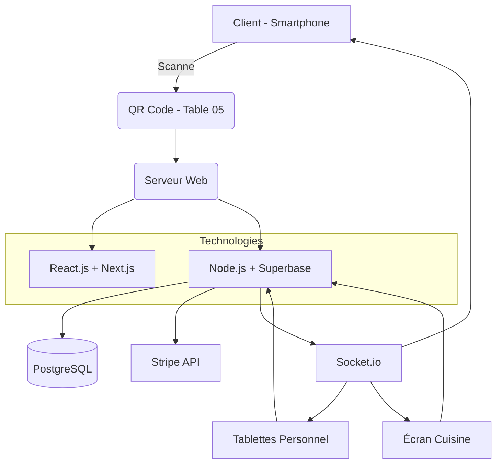

# 📑 CAHIER DES CHARGES 
## Plateforme de Gestion de Restaurant « SmartMenu »

**Version :** 1.0
**Date :** 20/08/2025
**Statut :** Rédigé

### **1. Résumé**

Le projet « SmartMenu » a pour objectif de révolutionner l'expérience client et l'opérationnel des restaurants en digitalisant intégralement le processus de commande via un système de QR Code unique par table. Cette solution tout-en-un comprend un menu digital interactif, un module de commande et paiement, un back-office de gestion en temps réel pour le personnel et un tableau de bord analytique pour la direction. Elle vise à augmenter l'efficacité, réduire les coûts, améliorer la satisfaction client et fournir des données précieuses pour la prise de décision.

### **2. Objectifs et Enjeux**

*   **Pour les Clients :**
    *   **Autonomie & Rapidité :** Commander et payer sans attente.
    *   **Expérience Riche :** Accès à des descriptions détaillées, photos HD, allergènes et recommandations.
    *   **Transparence :** Suivi en temps réel de l'état de sa commande (estimation du temps d'attente).
    *   **Flexibilité :** Possibilité de splitter l'addition et de payer par méthodes multiples.

*   **Pour le Restaurant :**
    *   **Gain de Productivité :** Réduction du temps de prise de commande et des allers-retours en salle.
    *   **Réduction des Erreurs :** Commandes transmises directement en cuisine, éliminant les erreurs de transcription.
    *   **Optimisation du Turnover :** Rotation plus rapide des tables grâce au paiement accéléré.
    *   **Gestion des Stocks :** Supervision en temps réel des niveaux de stock et alertes automatiques.
    *   **Data-Driven Decisions :** Analyses précises des ventes, de la profitabilité des plats et des préférences clients.

### **3. Périmètre du Projet**

**Inclus (In-Scope) :**
*   Application Web Progressive (PWA) pour les clients.
*   Application Web Admin/Serveur (Dashboard).
*   Module de Gestion de Menu et Stocks.
*   Module de Paiement Intégré.
*   Système de génération et gestion des QR Codes.
*   Base de données centralisée.
*   Formation du personnel.
*   Documentation technique et utilisateur.

**Non Inclus (Out-of-Scope) :**
*   Développement d'applications natives iOS/Android (dans un premier temps).
*   Matériel physique (terminaux de paiement, tablettes, imprimantes, mais une API pour l'intégration sera fournie).
*   Service de livraison à domicile (c'est une évolution future).
*   Site web public de présentation du restaurant (vitrine).

### **4. Description Détaillée des Fonctionnalités**

#### **4.1. Expérience Client (Frontend - PWA)**

*   **Accès & Authentification :**
    *   Scan du QR Code de la table -> redirection vers l'URL unique de la table.
    *   Pas de création de compte obligatoire pour commander.
    *   Option "Créer un compte" pour sauvegarder l'historique et ses préférences.

*   **Menu Digital Interactif :** (section enrichie)
    *   Affichage par catégories personnalisables (Apéritifs, Entrées, Plats...).
    *   Fiches produits complètes : **Photo HD, titre, description, prix, ingrédients, allergènes (mis en avant), tags (Végétarien, Vegan, Épicé, Maison...)**.
    *   **Filtres et Recherche :** par catégorie, allergène, tag, nom.
    *   **Indicateur de disponibilité en temps réel** (« Épuisé » grisé si plus en stock).
    *   **Menu modulaire** (ex: choix de cuisson, ajout/retrait d'ingrédients suppléments payants).
    *   **Réalité Augmentée :** Visualisation 3D des plats via la caméra du smartphone.
    *   **Recommandations IA :** Suggestions personnalisées basées sur l'historique et les préférences.
    *   **Calories et Valeurs Nutritionnelles :** Informations détaillées pour chaque plat.
    *   **Accords Mets-Vins :** Suggestions automatiques de boissons.
    *   **Mode Sombre/Clair :** Adaptation automatique selon l'heure.

*   **Processus de Commande :** 
    *   Panier dynamique avec résumé des articles et total.
    *   **Fonctionnalité "Commander en groupe" :** Plusieurs clients à une même table peuvent ajouter des articles dans un panier commun.
    *   Spécification des demandes spéciales (ex: "sans oignons", "sauce à part").
    *   Validation de la commande avec un récapitulatif final.
    *   **Split de l'addition :** Option pour diviser le bill de manière égale ou sélectionner les articles consommés par chaque personne.
    *   **Mode Précommande :** Réservation de table avec commande anticipée.
    *   **Timer de Service :** Synchronisation des plats pour une même table.
    *   **Mode Buffet :** Option pour les restaurants proposant des formules buffet.
    *   **Allergènes Croisés :** Détection automatique des incompatibilités.

*   **Paiement :**
    *   **Paiement en ligne intégré :** Carte bancaire (via Stripe/Braintree), Apple Pay, Google Pay.
    *   **Paiement traditionnel :** Option "Payer plus tard au comptoir".
    *   Reçu digital envoyé par email.

*   **Post-Commande :**
    *   **Suivi en temps réel de l'état** (« Reçue », « En Préparation », « Prête », « Servie »).
    *   **Estimateur de temps d'attente** basé sur la charge de la cuisine.
    *   **Système d'appel discret** (« Garçon », « Demander l'addition ») via une notification sur le dashboard serveur.
    *   **Formulaire de feedback et de notation** des plats à la fin du repas.

#### **4.2. Gestion du Restaurant (Backoffice/Admin)**

*   **Tableau de Bord Temps Réel :**
    *   Vue synthétique de l'état des tables (occupée/libre, commande en cours).
    *   **Interface Kanban/Tickets** pour gérer le flux des commandes (de la réception au service).
    *   Notifications sonores et visuelles pour les nouvelles commandes et appels.

*   **Gestion du Menu Avancée :**
    *   CRUD complet des catégories et articles.
    *   Gestion des variations de prix (tailles, suppléments).
    *   **Gestion des stocks :** Liaison des articles avec des ingrédients en stock. Décrémentation automatique à chaque commande. **Alertes de seuil faible**.
    *   Gestion des promotions (pourcentages, montants fixes, menus à prix fixe).

*   **Gestion des Tables & Salle :**
    *   Création du plan de salle visuel.
    *   Génération et impression des QR Codes par table.
    *   Association d'un serveur à un ensemble de tables.

*   **Reporting & Analytics (Trésorerie & Business Intelligence) :**
    *   **Chiffre d'affaires** (journalier, hebdomadaire, mensuel, comparatif).
    *   **Articles et catégories les plus/moins vendus** (en volume et en valeur).
    *   **Analyse de la profitabilité par plat** (coût des ingrédients vs prix de vente).
    *   **Performance des serveurs** (nombre de couverts, CA par serveur).
    *   **Heures de pointe** et temps d'attente moyen.
    *   **Taux de satisfaction client** (notes et retours).
    *   Export des données en PDF/CSV.

*   **Gestion des Utilisateurs & Rôles :**
    *   Rôles Administrateur, Manager, Serveur, Cuisinier avec des permissions granulaires.
    *   Suivi des connexions.

#### **4.3. Interface Cuisine (Vue Spécialisée)**

*   Écran dédié affichant **uniquement les commandes validées**.
*   regroupement des commandes par type de plat (pour optimiser la préparation).
*   Marquer une commande comme « En préparation », « Prête à servir ».
*   Historique des commandes de la journée.
*   Affichage sur écran TV ou tablette bon marché.

#### **4.4. Nouvelles Fonctionnalités Avancées**

*   **Intelligence Artificielle :**
    *   Prédiction des pics d'affluence.
    *   Optimisation automatique des prix selon la demande.
    *   Chatbot assistant pour les clients.
    *   Analyse des retours clients par NLP.

*   **Intégration IoT :**
    *   Capteurs de température pour le stockage.
    *   Systèmes automatisés de gestion des déchets.
    *   Monitoring énergétique de la cuisine.

*   **Gamification :**
    *   Système de badges pour les clients fidèles.
    *   Challenges culinaires et récompenses.
    *   Programme de parrainage digital.

*   **Durabilité :**
    *   Calcul de l'empreinte carbone des plats.
    *   Système de gestion des portions pour réduire le gaspillage.
    *   Suggestions d'alternatives écologiques.

### **5. Architecture Technique et Spécifications** 

*   **Frontend :** Application Web Progressive (PWA) avec **React.js** et  *Next.js** pour une expérience mobile native-like, offline-first.
*   **Backend :** API RESTful construite avec **Node.js (Express)**  pour la robustesse et la scalabilité.
*   **Base de Données :** **SuperBase (PostgreSQL)** pour la gestion des relations complexes (commandes, stocks, users) et la fiabilité.
*   **Communication Temps Réel :** **Socket.IO** ou **WebSockets** pour les notifications (nouvelles commandes, appels serveur, statuts).
*   **Paiement :** Intégration de **Stripe** ou équivalent (PCI DSS compliant).
*   **QR Codes :** Génération via une librairie comme `qrcode.js`. URL du type : `https://menu.restaurant.com/table/05`.
*   **Hébergement :** Cloud (AWS, Google Cloud, DigitalOcean) pour la scalabilité. Utilisation de conteneurs **Docker**.
*   **Sécurité :**
    *   HTTPS obligatoire.
    *   Validation des données côté serveur.
    *   Authentification par JWT (JSON Web Tokens).
    * *   **Sécurité :** (Suite)
        *   Protection contre les injections SQL, XSS, et CSRF.
        *   Mots de passe hashés (algorithme bcrypt).
        *   Rate Limiting sur l'API pour éviter les abus.

### **6. Contraintes et Hypothèses**

*   **Contraintes :**
    *   Le restaurant doit disposer d'une connexion Wi-Fi stable et performante.
    *   Le personnel doit être formé à l'utilisation du système.
    *   La solution doit être accessible et utilisable sur les smartphones récents (iOS & Android).

*   **Hypothèses :**
    *   Le client possède un smartphone avec un appareil photo et un navigateur web moderne.
    *   Le restaurant est responsable de l'impression et de la protection des QR Codes sur les tables.

### **7. Planning Prévisionnel (Phasage)**

| Phase | Activités | Durée Estimée |
| :--- | :--- | :--- |
| **Phase 1 : Conception** | Spécifications détaillées, Maquettes UX/UI, Architecture technique | 3 semaines |
| **Phase 2 : Développement MVP** | Backend Core, Base de données, Frontend Client (menu/commande), Dashboard basique | 8 semaines |
| **Phase 3 : Développement Avancé** | Module de paiement, Gestion des stocks, Reporting, Interface Cuisine | 6 semaines |
| **Phase 4 : Tests & Recettage** | Tests fonctionnels, Tests de charge, Tests de sécurité, Beta-test en conditions réelles | 3 semaines |
| **Phase 5 : Déploiement & Formation** | Mise en production, Formation du personnel, Documentation finale | 2 semaines |
| | **Durée Totale Estimée** | **22 semaines (~5 mois)** |

### **8. Évolutions Futures (Roadmap)** 

*   **Q2 2026 :** 
    * Applications natives
    * Intégration des assistants vocaux
*   **Q3 2026 :**
    * Système de réservation avancé avec IA
    * Module de gestion des événements
*   **Q4 2026 :**
    * Marketplace pour restaurants
    * Système de notation interne
*   **Q1 2027 :**
    * Module de livraison robotisée
    * Intégration VR/AR avancée
*   **Q2 2025 :**
    * Système prédictif de maintenance
    * Intelligence artificielle pour la gestion des stocks
*   **Q3 2027 :**
    * API publique et marketplace de plugins
    * Système de franchises automatisé